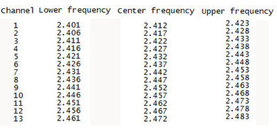

# Spectrum-analyzer-2.4-GHz
* The device is designed to scan the 2.4-GHz frequency range.
* Bluetooth devices with a channel width of 1-MHz.
* Wi-Fi devices with a channel width of 5 - 40-MHz.
* The module listens to each channel in the 1-MHz range and builds a graph of their workload, which can be used to judge the quality of the radio range.
* A graph of one color displays the state of the frequency range in the current time,a different color will be the graph with the history of maximum load.
*

### Wi-Fi radio frequency bands

### 1.44" 128 x 128 TFT Color Display Module for arduino pro mini SPI ILI9163
* VCC  -->  3V        
* GND  -->  GND       
* GND  -->  GND
* NC   -->  ---
* NC   -->  ---
* LED  -->  3V        
* CLK  -->  TFT_SCLK   3 
* SDI  -->  TFT_MOSI   4  
* RS   -->  TFT_DC     5 
* RST  -->  TFT_RST    6      
* CS   -->  TFT_CS     7

### Adapter nRF24L01+ arduino pro mini
* CE           9 (changes in the sketch) Mode selection: receiver / transmitter
* CSN (CS/SS) 10 (changes in the sketch) SPI bus - device selection
* SCK         13 (SCK) SPI bus - clock line
* MO          11 (MOSI) SPI bus - data line (master to slave)
* MI          12 (MISO) SPI bus - data line (slave to master)
* IRQ         Not used Interrupt

# Device diagram

